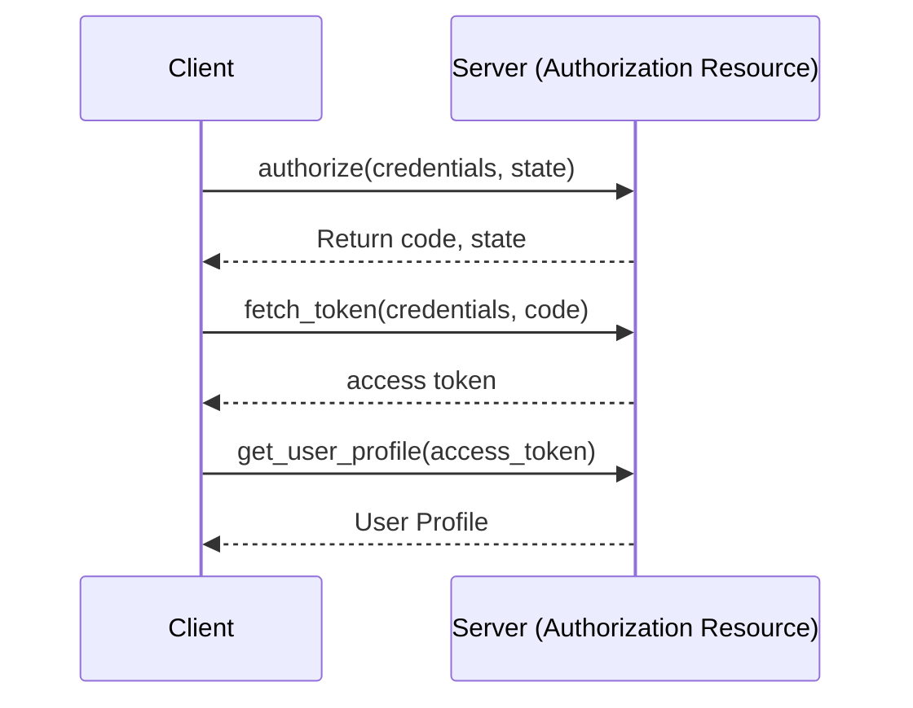

# OAuth2
Toy Implementation of OAuth2 in python with fastapi

```mermaid
sequenceDiagram
        participant C as Client
        participant A as Server (Authorization Resource)

C->>A: authorize(credentials, state)
A-->>C: Return code, state
C->>A: fetch_token(credentials, code)
A-->>C: access token
C->>A: get_user_profile(access_token)
A-->>C: User Profile
```
