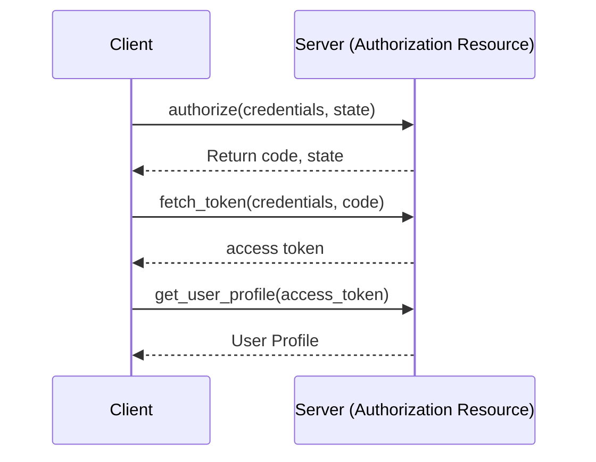

# OAuth2
Toy Implementation of OAuth2 in python with fastapi

## Steps to setup
1. Navigate to the root dir of the project and install third party packages
   ```
   pip install -r requirements/requirements.txt
   ```
2. Party time. Start the fastapi sever.
   ```
   uvicorn main:app --reload
   ```
3. In the browser of your choice, navigate to the docs page to interact with the authenticated root endpoint.
   ```
   http://127.0.0.1:8000/docs
   ```
4. Within the browser docs, click to the `Authorization` button and enter the `client_id` and `client_secret`
   ```
   client_id='johnsmith', client_secret='John smith'
   ```
5. On authentication success you can now execute the root endpoint request.

## Next Steps
This is a toy implementation and should NOT be used in a production environment. If you wish to implement OAuth2 more robustly, persistence should be utilized to securely store client ids and secrets. 


